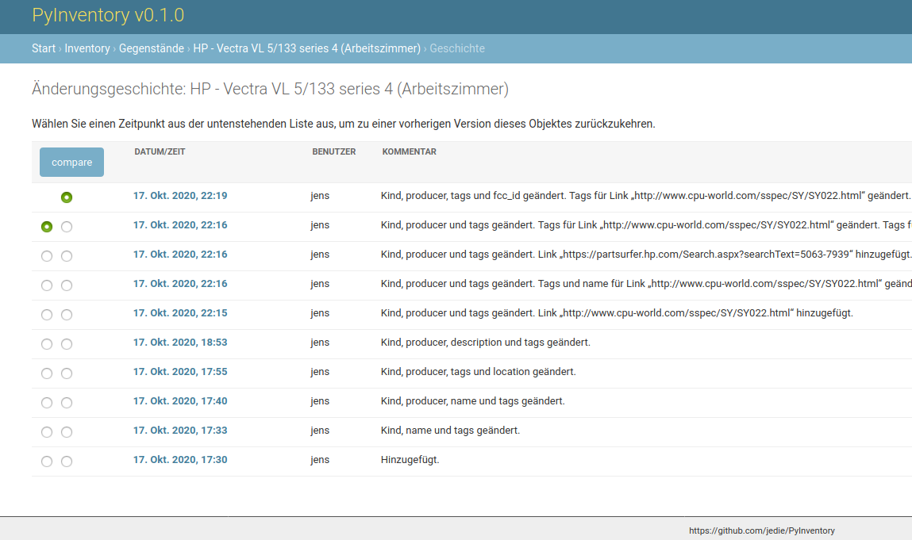
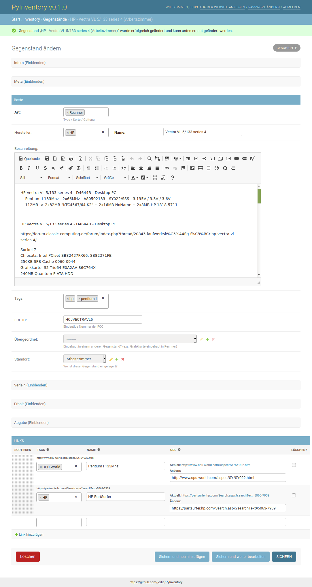
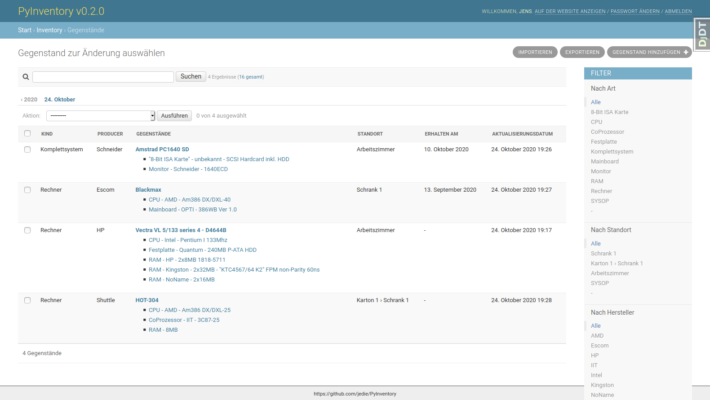

# PyInventory pour YunoHost

[](https://dash.yunohost.org/appci/app/pyinventory)    
[](https://install-app.yunohost.org/?app=pyinventory)

*[Read this readme in english.](./README.md)*
*[Lire ce readme en français.](./README_fr.md)*

> *Ce package vous permet d'installer PyInventory rapidement et simplement sur un serveur YunoHost.
Si vous n'avez pas YunoHost, regardez [ici](https://yunohost.org/#/install) pour savoir comment l'installer et en profiter.*

## Vue d'ensemble


**Version incluse :** 0.9.2~ynh1


## Captures d'écran





## Avertissements / informations importantes

* Any known limitations, constrains or stuff not working, such as (but not limited to):
    * requiring a full dedicated domain ?
    * architectures not supported ?
    * not-working single-sign on or LDAP integration ?
    * the app requires an important amount of RAM / disk / .. to install or to work properly
    * etc...

* Other infos that people should be aware of, such as:
    * any specific step to perform after installing (such as manually finishing the install, specific admin credentials, ...)
    * how to configure / administrate the application if it ain't obvious
    * upgrade process / specificities / things to be aware of ?
    * security considerations ?

## Settings and upgrades

Almost everything related to PyInventory's configuration is handled in a `"../conf/settings.py"` file.
You can edit the file `/opt/yunohost/pyinventory/local_settings.py` to enable or disable features.

Test sending emails:

```bash
ssh admin@yourdomain.tld
root@yunohost:~# cd /opt/yunohost/pyinventory/
root@yunohost:/opt/yunohost/pyinventory# source venv/bin/activate
(venv) root@yunohost:/opt/yunohost/pyinventory# ./manage.py sendtestemail --admins
```

Background info: Error mails are send to all [settings.ADMINS](https://docs.djangoproject.com/en/2.2/ref/settings/#std:setting-ADMINS). By default the YunoHost admin is inserted here.
To check current ADMINS run:

```bash
(venv) root@yunohost:/opt/yunohost/pyinventory# ./manage.py sendtestemail --admins
```

If you prefere to send error emails to a extrnal email address, just do something like this:

```bash
echo "ADMINS = (('Your Name', 'example@domain.tld'),)" >> /opt/yunohost/pyinventory/local_settings.py
```

To check the effective settings, run this:
```bash
(venv) root@yunohost:/opt/yunohost/pyinventory# ./manage.py diffsettings
```

## SSO authentication

[SSOwat](https://github.com/YunoHost/SSOwat) is fully supported via [django_ynh](https://github.com/YunoHost-Apps/django_ynh):

* First user (`$YNH_APP_ARG_ADMIN`) will be created as Django's super user
* All new users will be created as normal users
* Login via SSO is fully supported
* User Email, First / Last name will be updated from SSO data

## Documentations et ressources

* Dépôt de code officiel de l'app : https://github.com/jedie/PyInventory
* Documentation YunoHost pour cette app : https://yunohost.org/app_pyinventory
* Signaler un bug : https://github.com/YunoHost-Apps/pyinventory_ynh/issues

## Informations pour les développeurs

Merci de faire vos pull request sur la [branche testing](https://github.com/YunoHost-Apps/pyinventory_ynh/tree/testing).

Pour essayer la branche testing, procédez comme suit.
```
sudo yunohost app install https://github.com/YunoHost-Apps/pyinventory_ynh/tree/testing --debug
ou
sudo yunohost app upgrade pyinventory -u https://github.com/YunoHost-Apps/pyinventory_ynh/tree/testing --debug
```

**Plus d'infos sur le packaging d'applications :** https://yunohost.org/packaging_apps