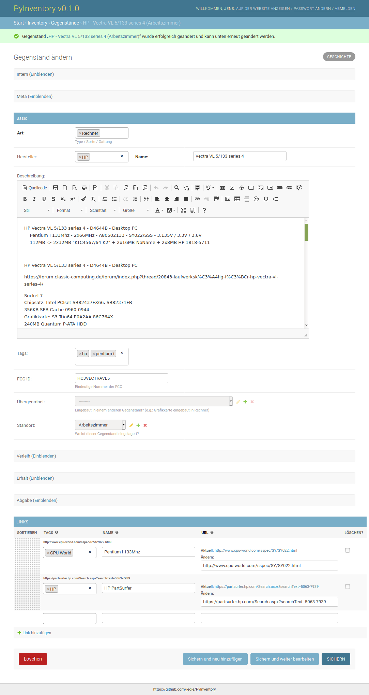
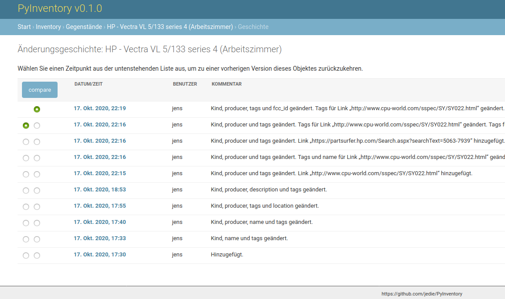
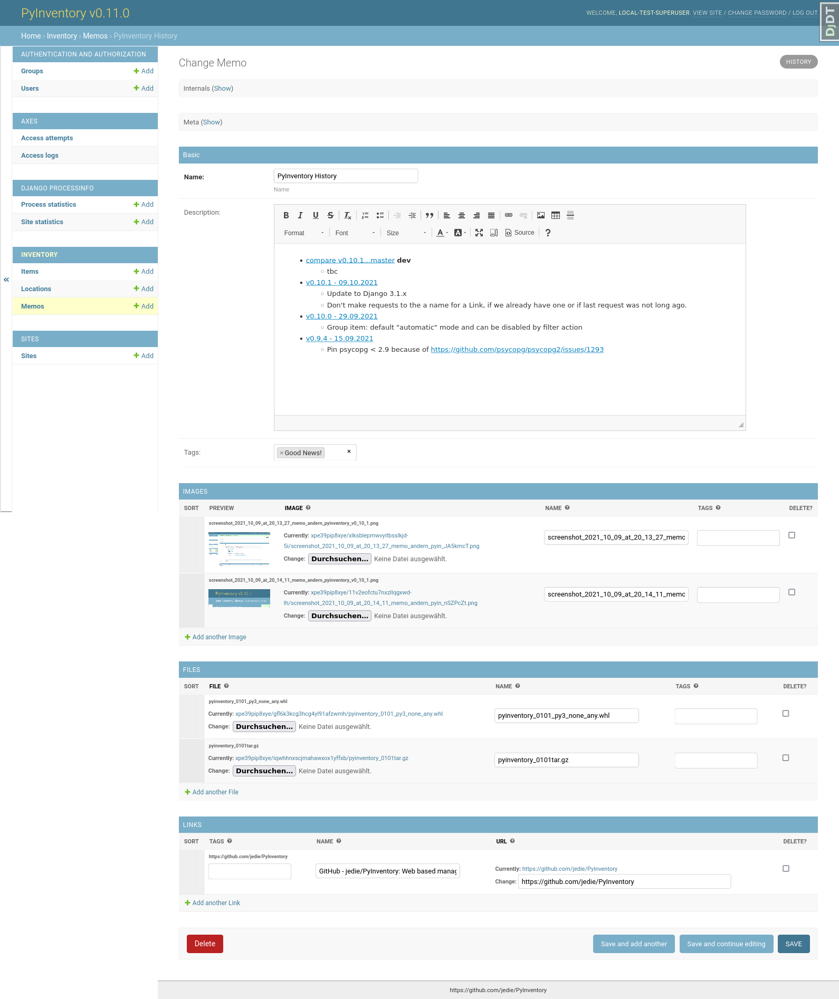

<!--
NOTA: Este README foi creado automáticamente por <https://github.com/YunoHost/apps/tree/master/tools/readme_generator>
NON debe editarse manualmente.
-->

# PyInventory para YunoHost

[](https://dash.yunohost.org/appci/app/pyinventory)  

[](https://install-app.yunohost.org/?app=pyinventory)

*[Le este README en outros idiomas.](./ALL_README.md)*

> *Este paquete permíteche instalar PyInventory de xeito rápido e doado nun servidor YunoHost.*  
> *Se non usas YunoHost, le a [documentación](https://yunohost.org/install) para saber como instalalo.*

## Vista xeral

[](https://github.com/YunoHost-Apps/pyinventory_ynh/actions/workflows/tests.yml)
[](https://app.codecov.io/github/jedie/pyinventory_ynh)
[](https://pypi.org/project/pyinventory_ynh/)
[](https://github.com/YunoHost-Apps/pyinventory_ynh/blob/main/pyproject.toml)
[](https://github.com/YunoHost-Apps/pyinventory_ynh/blob/main/LICENSE)

[PyInventory](https://github.com/jedie/PyInventory) is a libre web-based management to catalog things including state and location etc. using [Python](https://www.python.org/)/[Django](https://www.djangoproject.com/).

Pull requests welcome ;)

This package for YunoHost used [django-yunohost-integration](https://github.com/YunoHost-Apps/django_yunohost_integration)

More screenshots are here: jedie.github.io/tree/master/screenshots/PyInventory


**Versión proporcionada:** 0.19.3~ynh2

## Capturas de pantalla






## Documentación e recursos

- Repositorio de orixe do código: <https://github.com/jedie/PyInventory/>
- Tenda YunoHost: <https://apps.yunohost.org/app/pyinventory>
- Informar dun problema: <https://github.com/YunoHost-Apps/pyinventory_ynh/issues>

## Info de desenvolvemento

Envía a túa colaboración á [rama `testing`](https://github.com/YunoHost-Apps/pyinventory_ynh/tree/testing).

Para probar a rama `testing`, procede deste xeito:

```bash
sudo yunohost app install https://github.com/YunoHost-Apps/pyinventory_ynh/tree/testing --debug
ou
sudo yunohost app upgrade pyinventory -u https://github.com/YunoHost-Apps/pyinventory_ynh/tree/testing --debug
```

**Máis info sobre o empaquetado da app:** <https://yunohost.org/packaging_apps>
