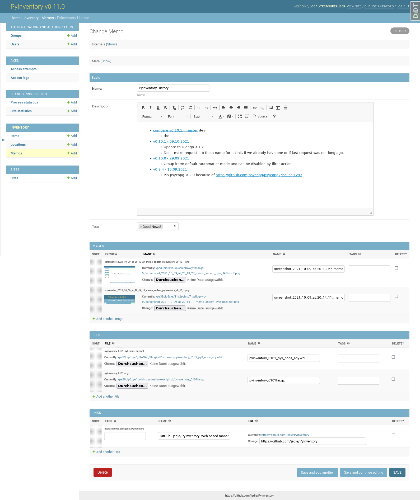

<!--
N.B.: README ini dibuat secara otomatis oleh <https://github.com/YunoHost/apps/tree/master/tools/readme_generator>
Ini TIDAK boleh diedit dengan tangan.
-->

# PyInventory untuk YunoHost

[](https://ci-apps.yunohost.org/ci/apps/pyinventory/)


[](https://install-app.yunohost.org/?app=pyinventory)

*[Baca README ini dengan bahasa yang lain.](./ALL_README.md)*

> *Paket ini memperbolehkan Anda untuk memasang PyInventory secara cepat dan mudah pada server YunoHost.*  
> *Bila Anda tidak mempunyai YunoHost, silakan berkonsultasi dengan [panduan](https://yunohost.org/install) untuk mempelajari bagaimana untuk memasangnya.*

## Ringkasan

[](https://github.com/YunoHost-Apps/pyinventory_ynh/actions/workflows/tests.yml)
[](https://app.codecov.io/github/jedie/pyinventory_ynh)
[](https://pypi.org/project/pyinventory_ynh/)
[](https://github.com/YunoHost-Apps/pyinventory_ynh/blob/main/pyproject.toml)
[](https://github.com/YunoHost-Apps/pyinventory_ynh/blob/main/LICENSE)

[PyInventory](https://github.com/jedie/PyInventory) is a libre web-based management to catalog things including state and location etc. using [Python](https://www.python.org/)/[Django](https://www.djangoproject.com/).

Pull requests welcome ;)

This package for YunoHost used [django-yunohost-integration](https://github.com/YunoHost-Apps/django_yunohost_integration)

More screenshots are here: jedie.github.io/tree/master/screenshots/PyInventory


**Versi terkirim:** 0.21.0~ynh1

## Tangkapan Layar





## Dokumentasi dan sumber daya

- Depot kode aplikasi hulu: <https://github.com/jedie/PyInventory>
- Gudang YunoHost: <https://apps.yunohost.org/app/pyinventory>
- Laporkan bug: <https://github.com/YunoHost-Apps/pyinventory_ynh/issues>

## Info developer

Silakan kirim pull request ke [`testing` branch](https://github.com/YunoHost-Apps/pyinventory_ynh/tree/testing).

Untuk mencoba branch `testing`, silakan dilanjutkan seperti:

```bash
sudo yunohost app install https://github.com/YunoHost-Apps/pyinventory_ynh/tree/testing --debug
atau
sudo yunohost app upgrade pyinventory -u https://github.com/YunoHost-Apps/pyinventory_ynh/tree/testing --debug
```

**Info lebih lanjut mengenai pemaketan aplikasi:** <https://yunohost.org/packaging_apps>
