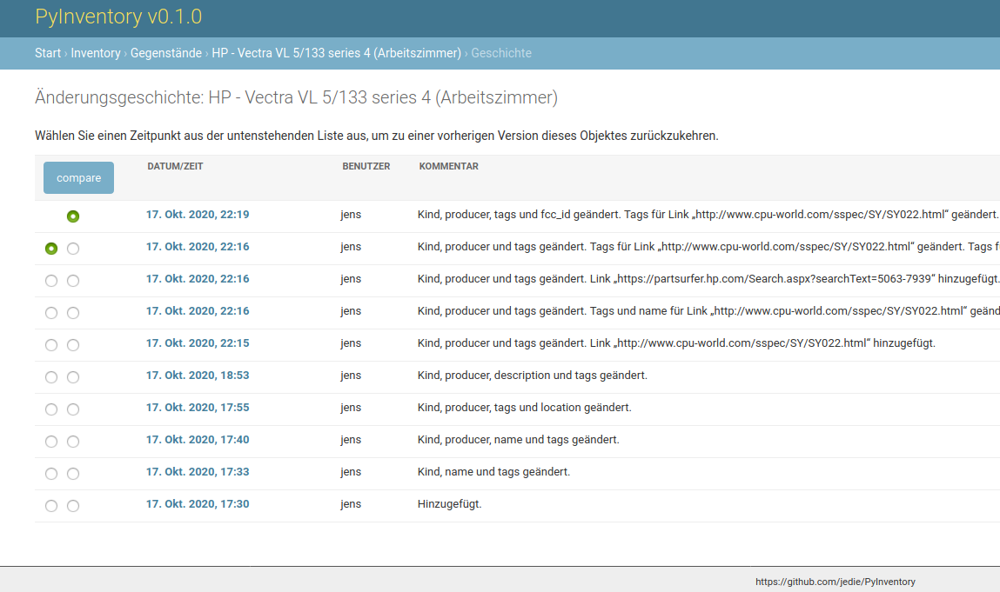

<!--
注意：此 README 由 <https://github.com/YunoHost/apps/tree/master/tools/readme_generator> 自动生成
请勿手动编辑。
-->

# YunoHost 上的 PyInventory

[](https://dash.yunohost.org/appci/app/pyinventory)  

[](https://install-app.yunohost.org/?app=pyinventory)

*[阅读此 README 的其它语言版本。](./ALL_README.md)*

> *通过此软件包，您可以在 YunoHost 服务器上快速、简单地安装 PyInventory。*  
> *如果您还没有 YunoHost，请参阅[指南](https://yunohost.org/install)了解如何安装它。*

## 概况

[](https://github.com/YunoHost-Apps/pyinventory_ynh/actions/workflows/tests.yml)
[](https://app.codecov.io/github/jedie/pyinventory_ynh)
[](https://pypi.org/project/pyinventory_ynh/)
[](https://github.com/YunoHost-Apps/pyinventory_ynh/blob/main/pyproject.toml)
[](https://github.com/YunoHost-Apps/pyinventory_ynh/blob/main/LICENSE)

[PyInventory](https://github.com/jedie/PyInventory) is a libre web-based management to catalog things including state and location etc. using [Python](https://www.python.org/)/[Django](https://www.djangoproject.com/).

Pull requests welcome ;)

This package for YunoHost used [django-yunohost-integration](https://github.com/YunoHost-Apps/django_yunohost_integration)

More screenshots are here: jedie.github.io/tree/master/screenshots/PyInventory


**分发版本：** 0.19.3~ynh2

## 截图





## 文档与资源

- 官方用户文档： <https://github.com/jedie/PyInventory>
- 官方管理文档： <https://github.com/YunoHost-Apps/pyinventory_ynh>
- 上游应用代码库： <https://github.com/YunoHost-Apps/pyinventory_ynh>
- YunoHost 商店： <https://apps.yunohost.org/app/pyinventory>
- 报告 bug： <https://github.com/YunoHost-Apps/pyinventory_ynh/issues>

## 开发者信息

请向 [`testing` 分支](https://github.com/YunoHost-Apps/pyinventory_ynh/tree/testing) 发送拉取请求。

如要尝试 `testing` 分支，请这样操作：

```bash
sudo yunohost app install https://github.com/YunoHost-Apps/pyinventory_ynh/tree/testing --debug
或
sudo yunohost app upgrade pyinventory -u https://github.com/YunoHost-Apps/pyinventory_ynh/tree/testing --debug
```

**有关应用打包的更多信息：** <https://yunohost.org/packaging_apps>
